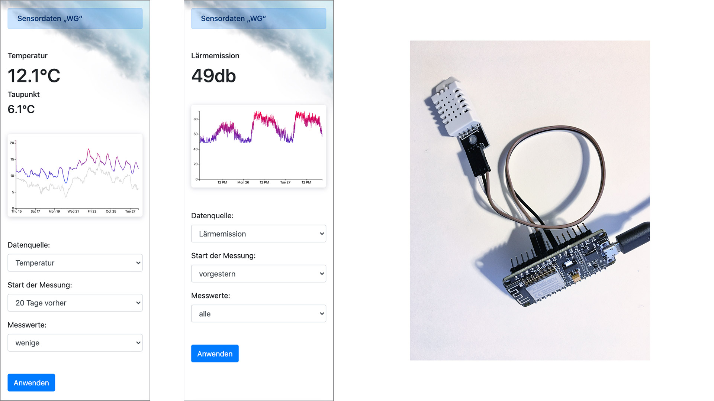

# ESP8266 Weather station 
# (temperature, humidity, dew point, decibel)
IoT getting started with ESP8266 (NodeMCU V1), DHT22 and LM393 Sensor

### Firmware
* ESP8266 receives data from DHT22 and LM393
* ESP8266 transmits data to MySQL database via WiFi

### Web interface
* Display data as graph (D3.js) on a webpage

### Preview

