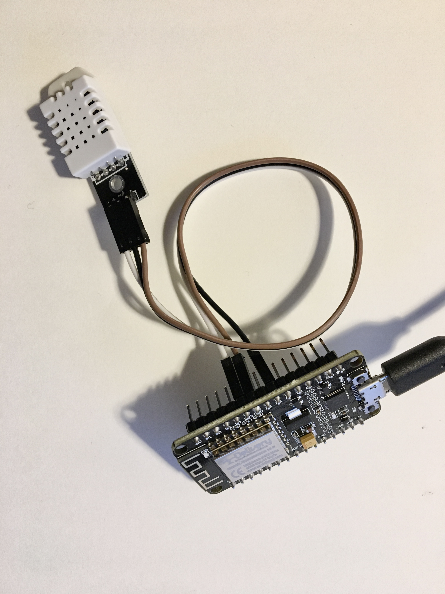
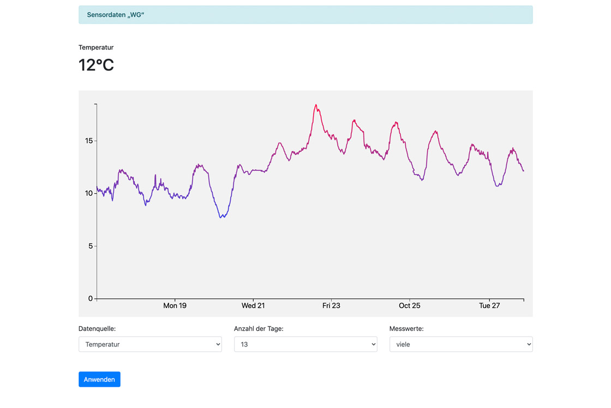

# IoT-Getting-Started-ESP8266-DHT22
IoT Getting started with ESP8266 (NodeMCU V1) and DHT22 Sensor

## Features:

### Firmware
* ESP8266 receives data from DHT22
* ESP8266 transmits data to MySQL database via WiFi

### Web interface
* Display data as graph (D3.js) on a webpage

